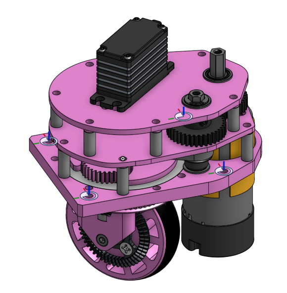

# Swerve Drive

*
*
*

Swerve Drive는 FTC에서는 많이 등장하지 않는 구동계이다.  FRC에서 주로 사용하는 구동계로 4개의 바퀴를 모듈화하여 제작해야한다.

## Swerve Drive에서의 운동학

## **Swerve Drive 적용 사례**

***

* [16379 Kookybotz ](swerve-drive.md#kookybotz)
* [21455 Rosophia](swerve-drive.md#id-21455-rosophia)
* [7643 Tungsten Tigers](swerve-drive.md#id-7643-tungsten-tigers-1)

### Kookybotz

* Kookybotz팀에서 적용한 Swerve 구동계로 가장 마음에 드는 구동 방식이다. 그러나 Kookybotz 팀 역시 2023-2024 Centerstage에서는 Mecanum 구동계를 적용한 로봇으로 World Championship에서 등장하였다.



### 21455 RoSophia



### 7643 Tungsten Tigers





## Swerve Drive에 대하여

*



## Swerve Drive 제작을 위한 자료

### 1. 14779 Swerve Drivetrains 제작을 위한 자료

* PDF 자료



* 3D 자료



### 2. 7643 Tungsten Tigers 팀의 Swerve 자료

* Parts List
* 3D Modeling
* Code



### 3. TerraVoxel 팀의 3D 모델링 자료



### 4. Robocorns Swerve 3D

<figure><figcaption></figcaption></figure>


